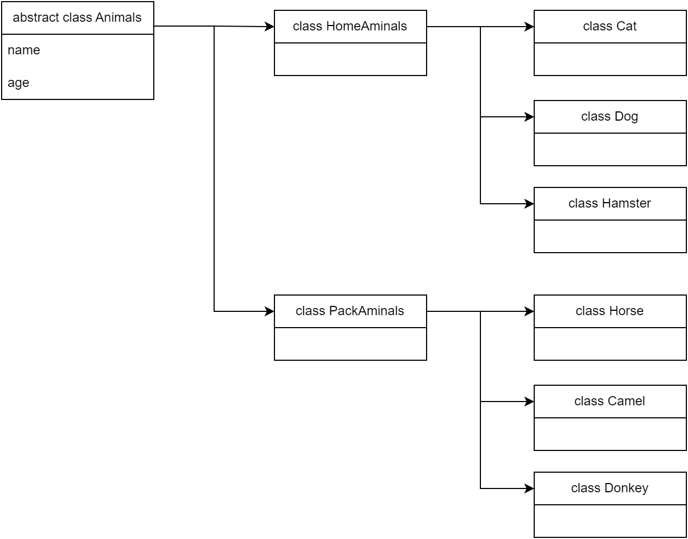

## Задание
1. Используя команду cat в терминале операционной системы Linux, создать
   два файла Домашние животные (заполнив файл собаками, кошками,
   хомяками) и Вьючные животными заполнив файл Лошадьми, верблюдами и
   ослы), а затем объединить их. Просмотреть содержимое созданного файла.
   Переименовать файл, дав ему новое имя (Друзья человека).
> cat > "Домашние животные"  
собаки  
кошки  
хомяки  
Ctrl + D  
cat > "Вьючные животные"  
лошади  
верблюды  
ослы  
Ctrl + D  
cat "Домашние животные" "Вьючные животные" > "Звери"  
cat "Звери"  
mv "Звери" "Друзья человека"

2. Создать директорию, переместить файл туда.
> mkdir animals  
mv "Друзья человека animals/
3. Подключить дополнительный репозиторий MySQL. Установить любой пакет
   из этого репозитория.
> sudo su  
wget -O- https://repo.mysql.com/RPM-GPG-KEY-mysql-2022 | sudo apt-key add -  
echo "deb http://repo.mysql.com/apt/ubuntu/ $(lsb_release -sc) mysql-8.0" | sudo tee /etc/apt/sources.list.d/mysql.list  
sudo apt update  
sudo apt install mysql-shell  

4. Установить и удалить deb-пакет с помощью dpkg.  
> wget http://archive.ubuntu.com/ubuntu/pool/universe/m/mc/mc_4.8.25-2ubuntu2_amd64.deb  
dpkg -i mc_4.8.25-2ubuntu2_amd64.deb  
dpkg -r mc
5. Выложить историю команд в терминале ubuntu
6. Нарисовать диаграмму, в которой есть класс родительский класс, домашние
   животные и вьючные животные, в составы которых в случае домашних
   животных войдут классы: собаки, кошки, хомяки, а в класс вьючные животные
   войдут: Лошади, верблюды и ослы).

7. В подключенном MySQL репозитории создать базу данных “Друзья
   человека”
> CREATE DATABASE human_friends;
8. Создать таблицы с иерархией из диаграммы в БД
>   USE human_friends;  
CREATE TABLE animals  
(  
id INT AUTO_INCREMENT PRIMARY KEY,  
animal_type VARCHAR(30)
);  
INSERT INTO animals (animal_type)  
VALUES ('Домашние животные'), ('Вьючные животные');  
CREATE TABLE pets  
(  
id INT AUTO_INCREMENT PRIMARY KEY,  
animal_kind VARCHAR(30),  
animal_type_id INT DEFAULT 1,  
FOREIGN KEY (animal_type_id) REFERENCES animals (id) ON DELETE CASCADE ON UPDATE CASCADE  
);  
INSERT INTO pets (animal_kind  
VALUES ('Собаки'), ('Кошки'), ('Хомяки');  
CREATE TABLE pack_animals  
(  
id INT AUTO_INCREMENT PRIMARY KEY,  
animal_kind VARCHAR(30),  
animal_type_id INT DEFAULT 2,  
FOREIGN KEY (animal_type_id) REFERENCES animals (id) ON DELETE CASCADE ON UPDATE CASCADE  
);  
INSERT INTO pack_animals (animal_kind)  
VALUES ('Лошади'), ('Верблюды'), ('Ослы');  
9. Заполнить низкоуровневые таблицы именами(животных), командами
   которые они выполняют и датами рождения
> CREATE TABLE dogs  
(           
id INT AUTO_INCREMENT PRIMARY KEY,  
name VARCHAR(30),  
commands VARCHAR(100),  
birthday DATE,  
animal_kind_id INT DEFAULT 1,  
Foreign KEY (animal_kind_id) REFERENCES pets (id) ON DELETE CASCADE ON UPDATE CASCADE  
);  
INSERT INTO dogs (name, commands, birthday)  
VALUES ('Шарик', 'ко мне, апрот, рядом, сидеть', '2023-01-12'),  
('Тобик', 'дай лапу, голос, сидеть', '2020-10-11'),  
('Лорд', 'сидеть, стереги, след, ко мне, дай', '2018-11-07');  
CREATE TABLE cats  
(           
id INT AUTO_INCREMENT PRIMARY KEY,  
name VARCHAR(30),  
commands VARCHAR(100),  
birthday DATE,  
animal_kind_id INT DEFAULT 2,  
Foreign KEY (animal_kind_id) REFERENCES pets (id) ON DELETE CASCADE ON UPDATE CASCADE  
);  
INSERT INTO cats (name, commands, birthday)  
VALUES ('Муся', 'голос', '2020-05-05'),  
('Вася', 'служи', '2021-06-06'),  
('Степа', 'спать', '2023-01-05');  
CREATE TABLE hamsters  
(         
id INT AUTO_INCREMENT PRIMARY KEY,  
name VARCHAR(30),  
commands VARCHAR(100),  
birthday DATE,  
animal_kind_id INT DEFAULT 3,  
Foreign KEY (animal_kind_id) REFERENCES pets (id) ON DELETE CASCADE ON UPDATE CASCADE  
);
INSERT INTO hamsters (name, commands, birthday)  
VALUES ('Пышка', 'служи', '2023-04-16'),  
('Кузя', 'служи, кушать, ко мне', '2023-03-20'),  
('Жорик', 'ням-ням', '2022-12-21');  
CREATE TABLE horses  
(         
id INT AUTO_INCREMENT PRIMARY KEY,  
name VARCHAR(30),  
commands VARCHAR(100),  
birthday DATE,  
animal_kind_id INT DEFAULT 1,  
Foreign KEY (animal_kind_id) REFERENCES pack_animals (id) ON DELETE CASCADE ON UPDATE CASCADE  
INSERT INTO horses (name, commands, birthday)  
VALUES ('Сивка', 'стой, лечь, пошли, вперед, встать, сесть, тихо', '2015-07-10'),  
('Бурка', 'стой, рысь, лечь, пошли, шагом', '2019-12-10'),  
('Ворон', 'стой, встать, сесть, тихо, хоп', '2021-05-15');  
CREATE TABLE camels    
(           
id INT AUTO_INCREMENT PRIMARY KEY,      
commands VARCHAR(100),    
birthday DATE,  
animal_kind_id INT DEFAULT 2,  
Foreign KEY (animal_kind_id) REFERENCES pack_animals (id) ON DELETE CASCADE ON UPDATE CASCADE    
);  
INSERT INTO camels (name, commands, birthday)  
VALUES ('Джерри', 'дурр, гит, каш', '2017-10-10'),  
('Чак', 'дурр, гит, каш', '2016-11-11'),  
('Гарри', 'дурр, гит, каш', '2015-12-12');  
CREATE TABLE donkeys  
(         
id INT AUTO_INCREMENT PRIMARY KEY,  
name VARCHAR(30),  
commands VARCHAR(100),  
birthday DATE,  
animal_kind_id INT DEFAULT 3,  
Foreign KEY (animal_kind_id) REFERENCES pack_animals (id) ON DELETE CASCADE ON UPDATE CASCADE  
);  
INSERT INTO donkeys (name, commands, birthday)  
VALUES ('Лулу', 'вперед, стоять', '2019-11-17'),  
('Тоша', 'вперед, стоять', '2021-02-10'),  
('Люся', 'вперед, стоять', '2020-07-29');  
10. Удалив из таблицы верблюдов, т.к. верблюдов решили перевезти в другой
    питомник на зимовку. Объединить таблицы лошади, и ослы в одну таблицу.
>DELETE FROM camels;  
CREATE TABLE horses_and_donkeys SELECT * FROM horses  
UNION SELECT * FROM donkeys;  
11. Создать новую таблицу “молодые животные” в которую попадут все
    животные старше 1 года, но младше 3 лет и в отдельном столбце с точностью
    до месяца подсчитать возраст животных в новой таблице.
> CREATE TEMPORARY TABLE all_animals  
SELECT * FROM dogs  
UNION SELECT * FROM cats  
UNION SELECT * FROM hamsters  
UNION SELECT * FROM horses  
UNION SELECT * FROM camels  
UNION SELECT * FROM donkeys;  
CREATE TABLE young_animals  
SELECT name, commands, birthday, animal_kind_id, TIMESTAMPDIFF(MONTH, birthday, CURDATE()) AS age_in_month  
FROM all_animals  
WHERE birthday BETWEEN ADDDATE(CURDATE(), INTERVAL -3 YEAR) AND ADDDATE(CURDATE(), INTERVAL -1 YEAR);  
12. Объединить все таблицы в одну, при этом сохраняя поля, указывающие на
    прошлую принадлежность к старым таблицам.
> SELECT dogs.name, dogs.commands, dogs.birthday, pets.animal_kind, animals.animal_type  
FROM dogs  
LEFT JOIN pets ON pets.id = dogs.animal_kind_id  
LEFT JOIN animals ON animals.id=pets.animal_type_id  
UNION  
SELECT cats.name, cats.commands, cats.birthday, pets.animal_kind, animals.animal_type  
FROM cats  
LEFT JOIN pets ON pets.id = cats.animal_kind_id  
LEFT JOIN animals ON animals.id=pets.animal_type_id  
UNION  
SELECT hamsters.name, hamsters.commands, hamsters.birthday, pets.animal_kind, animals.animal_type  
FROM hamsters  
LEFT JOIN pets ON pets.id = hamsters.animal_kind_id  
LEFT JOIN animals ON animals.id=pets.animal_type_id  
UNION  
SELECT horses.name, horses.commands, horses.birthday, pack_animals.animal_kind, animals.animal_type  
FROM horses  
LEFT JOIN pack_animals ON pack_animals.id = horses.animal_kind_id  
LEFT JOIN animals ON animals.id=pack_animals.animal_type_id  
UNION  
SELECT camels.name, camels.commands, camels.birthday, pack_animals.animal_kind, animals.animal_type  
FROM camels  
LEFT JOIN pack_animals ON pack_animals.id = camels.animal_kind_id  
LEFT JOIN animals ON animals.id=pack_animals.animal_type_id  
UNION  
SELECT donkeys.name, donkeys.commands, donkeys.birthday, pack_animals.animal_kind, animals.animal_type  
FROM donkeys  
LEFT JOIN pack_animals ON pack_animals.id = donkeys.animal_kind_id  
LEFT JOIN animals ON animals.id=pack_animals.animal_type_id;  